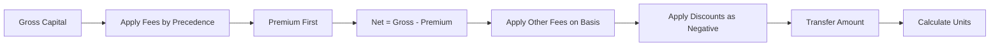

# ARCHON Fee Engine - Complete Agent Context & Reasoning Framework

> Canonical reference for the Fees feature is `FEATURES/fees/README.md`. This document provides deep context for reasoning but defers to the feature index for navigation and current workflows.

## Executive Summary

The ARCHON Fee Engine is a **deterministic, order-dependent system** that calculates investor transfer amounts through a precise sequence of fee applications. This document provides complete context for AI agents to reason through and implement fee calculations using the exact Supabase schema without modifications.

## Core Mental Model



## Supabase Schema - Exact Implementation

### Primary Tables (USE EXACTLY AS IS)

```sql
-- Fee Schedule: Source of truth for all fee components
fees.fee_schedule (
  schedule_id SERIAL PRIMARY KEY,
  deal_id INTEGER REFERENCES deals.deal,
  component TEXT,           -- 'PREMIUM', 'STRUCTURING', 'MANAGEMENT', etc.
  rate DECIMAL(10,4),       -- Fee rate (0.02 = 2%)
  is_percent BOOLEAN,       -- true = percentage, false = flat amount
  basis TEXT,               -- 'GROSS' | 'NET' | 'NET_AFTER_PREMIUM'
  precedence INTEGER,       -- Order of application (lower = earlier)
  effective_at TIMESTAMP,
  created_at TIMESTAMP,
  updated_at TIMESTAMP
)

-- Fee Application: Actual fees applied (positive and negative)
fees.fee_application (
  id SERIAL PRIMARY KEY,
  transaction_id INTEGER,
  deal_id INTEGER,
  component TEXT,           -- Includes base and '_DISCOUNT' variants
  amount DECIMAL(15,2),     -- Positive for fees, NEGATIVE for discounts
  percent DECIMAL(10,4),    -- Rate used for audit
  applied BOOLEAN DEFAULT true,
  notes TEXT,              -- Audit trail with calculation details
  created_at TIMESTAMP,
  updated_at TIMESTAMP
)

-- Schedule Versions: Control which schedule is active
fees.schedule_version (
  id SERIAL PRIMARY KEY,
  schedule_id INTEGER REFERENCES fees.fee_schedule,
  version INTEGER,
  calculator_profile_id INTEGER,
  effective_at TIMESTAMP,
  is_active BOOLEAN DEFAULT false  -- Only one active per deal
)
```

## Fee Calculation Algorithm - Schema Accurate

### Step 1: Load Active Fee Schedule

```typescript
async function loadActiveFeeSchedule(
  dealId: number
): Promise<FeeScheduleRow[]> {
  const { data } = await supabase
    .from("fees.fee_schedule")
    .select(
      `
      *,
      schedule_version!inner(is_active)
    `
    )
    .eq("deal_id", dealId)
    .eq("schedule_version.is_active", true)
    .lte("effective_at", new Date())
    .order("precedence", { ascending: true }); // CRITICAL: Order by precedence

  return data || [];
}
```

### Step 2: Calculate Fees in Precedence Order

```typescript
interface FeeCalculationState {
  grossAmount: number;
  netAmount: number;
  premiumAmount: number;
  runningAmount: number;
  appliedFees: FeeApplication[];
}

function calculateFeesWithPrecedence(
  schedule: FeeScheduleRow[],
  grossCapital: number
): FeeCalculationState {
  const state: FeeCalculationState = {
    grossAmount: grossCapital,
    netAmount: grossCapital,
    premiumAmount: 0,
    runningAmount: grossCapital,
    appliedFees: [],
  };

  // Process each fee in precedence order
  for (const fee of schedule) {
    const baseAmount = getBaseAmount(fee.basis, state);

    let feeAmount: number;
    if (fee.is_percent) {
      feeAmount = Math.round(baseAmount * fee.rate * 100) / 100; // Round to 2dp
    } else {
      feeAmount = fee.rate; // Flat amount
    }

    // Special handling for PREMIUM
    if (fee.component === "PREMIUM") {
      state.premiumAmount = feeAmount;
      state.netAmount = state.grossAmount - state.premiumAmount;
    }

    // Store as positive amount
    state.appliedFees.push({
      component: fee.component,
      amount: feeAmount,
      percent: fee.is_percent ? fee.rate : null,
      basis: fee.basis,
      notes: `Applied at precedence ${fee.precedence}, basis: ${fee.basis}`,
    });

    // Update running amount for next calculation
    state.runningAmount = state.runningAmount - feeAmount;
  }

  return state;
}

function getBaseAmount(basis: string, state: FeeCalculationState): number {
  switch (basis) {
    case "GROSS":
      return state.grossAmount;
    case "NET":
      return state.netAmount;
    case "NET_AFTER_PREMIUM":
      return state.netAmount - state.premiumAmount;
    default:
      return state.runningAmount;
  }
}
```

### Step 3: Apply Discounts as Negative Rows

```typescript
interface DiscountInput {
  component: string; // e.g., 'STRUCTURING_DISCOUNT'
  percent?: number;
  amount?: number;
  basis?: string;
}

function applyDiscounts(
  state: FeeCalculationState,
  discounts: DiscountInput[]
): FeeCalculationState {
  for (const discount of discounts) {
    // Find the base fee this discount applies to
    const baseComponent = discount.component.replace("_DISCOUNT", "");
    const baseFee = state.appliedFees.find(
      (f) => f.component === baseComponent
    );

    if (!baseFee) continue;

    let discountAmount: number;
    if (discount.percent) {
      discountAmount =
        Math.round(baseFee.amount * discount.percent * 100) / 100;
    } else if (discount.amount) {
      discountAmount = Math.min(discount.amount, baseFee.amount); // Cap at base fee
    } else {
      continue;
    }

    // CRITICAL: Store as NEGATIVE amount
    state.appliedFees.push({
      component: discount.component,
      amount: -Math.abs(discountAmount), // Always negative
      percent: discount.percent,
      basis: discount.basis || baseFee.basis,
      notes: `Discount on ${baseComponent}`,
    });

    // Add back to running amount (discount reduces fees)
    state.runningAmount += discountAmount;
  }

  return state;
}
```

### Step 4: Calculate Final Transfer and Units

```typescript
function calculateFinalAmounts(state: FeeCalculationState, unitPrice: number) {
  // Sum positive fees (base fees)
  const transferPreDiscount = state.appliedFees
    .filter((f) => f.amount > 0)
    .reduce((sum, f) => sum + f.amount, 0);

  // Sum negative fees (discounts)
  const totalDiscounts = Math.abs(
    state.appliedFees
      .filter((f) => f.amount < 0)
      .reduce((sum, f) => sum + f.amount, 0)
  );

  const transferPostDiscount = transferPreDiscount - totalDiscounts;

  // Units calculation (always floor, no fractional units)
  const units = Math.floor(state.netAmount / unitPrice);

  return {
    transferPreDiscount,
    totalDiscounts,
    transferPostDiscount,
    units,
    invariantCheck: {
      // Critical validation
      valid:
        Math.abs(transferPreDiscount - totalDiscounts - transferPostDiscount) <
        0.01,
      message: "Transfer amounts must reconcile",
    },
  };
}
```

### Step 5: Persist to Database

```typescript
async function persistFeeApplication(
  transactionId: number,
  dealId: number,
  state: FeeCalculationState
): Promise<void> {
  // Insert all fees including discounts (negative amounts)
  const records = state.appliedFees.map((fee) => ({
    transaction_id: transactionId,
    deal_id: dealId,
    component: fee.component,
    amount: fee.amount, // Can be positive OR negative
    percent: fee.percent,
    applied: true,
    notes: fee.notes,
  }));

  await supabase.from("fees.fee_application").insert(records);
}
```

## Component Architecture

### 1. Fee Components (Positive Amounts)

```typescript
const BASE_FEE_COMPONENTS = [
  { name: "PREMIUM", defaultBasis: "GROSS", defaultPrecedence: 1 },
  { name: "STRUCTURING", defaultBasis: "NET", defaultPrecedence: 2 },
  {
    name: "MANAGEMENT",
    defaultBasis: "NET_AFTER_PREMIUM",
    defaultPrecedence: 3,
  },
  { name: "ADMIN", defaultBasis: "NET_AFTER_PREMIUM", defaultPrecedence: 4 },
  {
    name: "PERFORMANCE",
    defaultBasis: "NET_AFTER_PREMIUM",
    defaultPrecedence: 5,
  },
  { name: "ADVISORY", defaultBasis: "GROSS", defaultPrecedence: 6 },
];
```

### 2. Discount Components (Negative Amounts)

```typescript
const DISCOUNT_COMPONENTS = [
  "STRUCTURING_DISCOUNT", // Reduces structuring fee
  "MANAGEMENT_DISCOUNT", // Reduces management fee
  "ADMIN_DISCOUNT", // Reduces admin fee
  // Pattern: <BASE_COMPONENT>_DISCOUNT
];
```

### 3. Partner Components (Excluded from Investor Analytics)

```typescript
const PARTNER_COMPONENTS = [
  "PARTNER_MGMT", // Partner management share
  "PARTNER_CARRY", // Partner carried interest
];

// In analytics views, exclude these:
function getInvestorTransferAmount(fees: FeeApplication[]): number {
  return fees
    .filter((f) => !f.component.startsWith("PARTNER_"))
    .reduce((sum, f) => sum + f.amount, 0);
}
```

## Annual Fees Handling

```typescript
function handleAnnualFees(fee: FeeScheduleRow, years: number): FeeApplication {
  const annualRate = fee.rate;
  const totalAmount = annualRate * years * getBaseAmount(fee.basis);

  return {
    component: fee.component,
    amount: Math.round(totalAmount * 100) / 100,
    percent: annualRate,
    notes: `annual x ${years} years`, // Critical for audit
  };
}
```

## Validation Rules & Invariants

### Critical Invariants (MUST ALWAYS HOLD)

```typescript
class FeeInvariantValidator {
  validate(calculation: FeeCalculationResult): ValidationResult {
    const errors: string[] = [];

    // 1. Precedence order must be respected
    const sorted = calculation.fees
      .slice()
      .sort((a, b) => a.precedence - b.precedence);
    if (!arraysEqual(calculation.fees, sorted)) {
      errors.push("Fees not applied in precedence order");
    }

    // 2. Basis calculations must be accurate
    if (
      calculation.netAmount !==
      calculation.grossAmount - calculation.premiumAmount
    ) {
      errors.push("Net amount calculation incorrect");
    }

    // 3. Discounts must be negative
    const discounts = calculation.fees.filter((f) =>
      f.component.includes("_DISCOUNT")
    );
    if (discounts.some((d) => d.amount >= 0)) {
      errors.push("Discounts must be negative amounts");
    }

    // 4. Transfer reconciliation
    const preDiscount = calculation.fees
      .filter((f) => f.amount > 0)
      .reduce((s, f) => s + f.amount, 0);
    const discountTotal = Math.abs(
      calculation.fees
        .filter((f) => f.amount < 0)
        .reduce((s, f) => s + f.amount, 0)
    );
    const postDiscount = preDiscount - discountTotal;

    if (Math.abs(postDiscount - calculation.transferPostDiscount) > 0.01) {
      errors.push("Transfer amounts do not reconcile");
    }

    // 5. Rounding consistency (2 decimal places)
    if (
      calculation.fees.some(
        (f) => f.amount !== Math.round(f.amount * 100) / 100
      )
    ) {
      errors.push("Amounts not rounded to 2 decimal places");
    }

    // 6. Units must be integers
    if (!Number.isInteger(calculation.units)) {
      errors.push("Units must be whole numbers");
    }

    return {
      valid: errors.length === 0,
      errors,
    };
  }
}
```

## Implementation Services

### Enhanced Fee Service

```typescript
export class EnhancedFeeService {
  async calculateWithFullAudit(
    dealId: number,
    grossCapital: number,
    discounts?: DiscountInput[]
  ): Promise<AuditedCalculation> {
    // 1. Load schedule ordered by precedence
    const schedule = await this.loadActiveFeeSchedule(dealId);

    // 2. Calculate base fees in order
    let state = calculateFeesWithPrecedence(schedule, grossCapital);

    // 3. Apply discounts as negative rows
    if (discounts) {
      state = applyDiscounts(state, discounts);
    }

    // 4. Calculate final amounts
    const final = calculateFinalAmounts(state, unitPrice);

    // 5. Validate invariants
    const validation = new FeeInvariantValidator().validate({
      fees: state.appliedFees,
      ...final,
    });

    if (!validation.valid) {
      throw new Error(`Invariant violations: ${validation.errors.join(", ")}`);
    }

    // 6. Return with full audit trail
    return {
      calculation: state,
      final,
      validation,
      auditId: generateAuditId(),
      timestamp: new Date(),
      metadata: {
        scheduleVersion: schedule[0]?.version,
        precedenceOrder: schedule.map((s) => s.component).join(" -> "),
      },
    };
  }
}
```

## Zero-Shot Prompts for AI Agents

### Basic Operations

```
"Calculate fees for a $1M investment in deal 123 using the active fee schedule ordered by precedence"

"Apply a 50% structuring discount to investor 456 by creating a negative fee_application row"

"Generate fee schedule with premium at precedence 1, structuring at 2, management at 3"

"Validate that all discounts in fee_application are stored as negative amounts"

"Calculate units as floor(net_capital / unit_price) ensuring no fractional units"
```

### Complex Scenarios

```
"Create a fee schedule where management fee uses NET_AFTER_PREMIUM basis and performance fee triggers only above 8% hurdle"

"Apply partner fees that are excluded from investor transfer calculations"

"Handle annual management fee of 2% for 3 years, storing as single row with notes 'annual x 3 years'"

"Reconcile transfer amounts: verify pre-discount minus discounts equals post-discount"

"Migrate legacy fees preserving precedence order and converting discounts to negative rows"
```

## Common Patterns & Solutions

### Pattern 1: Premium Always First

```typescript
// Premium MUST have precedence = 1
await supabase.from("fees.fee_schedule").insert({
  deal_id: dealId,
  component: "PREMIUM",
  rate: premiumRate,
  is_percent: true,
  basis: "GROSS", // Always on gross
  precedence: 1, // Always first
});
```

### Pattern 2: Discounts as Negative

```typescript
// Never store discount as positive reduction
// WRONG: { component: 'STRUCTURING', amount: 4000 - 2000 }
// RIGHT:
[
  { component: "STRUCTURING", amount: 4000 },
  { component: "STRUCTURING_DISCOUNT", amount: -2000 },
];
```

### Pattern 3: Basis Chain

```typescript
// Each fee can reference different basis
const basisChain = {
  PREMIUM: grossCapital, // GROSS
  STRUCTURING: netCapital, // NET
  MANAGEMENT: netCapital - premiumAmount, // NET_AFTER_PREMIUM
  ADMIN: netCapital - premiumAmount, // NET_AFTER_PREMIUM
};
```

## Error Recovery & Edge Cases

### Edge Case 1: Missing Precedence

```typescript
if (!fee.precedence) {
  // Fallback to component-based ordering
  const defaultOrder = {
    PREMIUM: 1,
    STRUCTURING: 2,
    MANAGEMENT: 3,
    ADMIN: 4,
    PERFORMANCE: 5,
  };
  fee.precedence = defaultOrder[fee.component] || 99;
}
```

### Edge Case 2: Discount Exceeds Base Fee

```typescript
const discountAmount = Math.min(
  requestedDiscount,
  baseFeeAmount // Cap at 100% of base fee
);
```

### Edge Case 3: Circular Basis Reference

```typescript
// Detect and prevent circular references
const basisDependencies = {
  GROSS: [],
  NET: ["GROSS"],
  NET_AFTER_PREMIUM: ["GROSS", "NET"],
};

function validateBasisOrder(schedule: FeeScheduleRow[]): boolean {
  // Ensure dependencies are calculated first
  return schedule.every((fee, idx) => {
    const deps = basisDependencies[fee.basis] || [];
    const priorComponents = schedule.slice(0, idx).map((f) => f.component);
    return deps.every((dep) =>
      priorComponents.some((c) => affectsBasis(c, dep))
    );
  });
}
```

## Performance Optimizations

### Caching Fee Schedules

```typescript
class FeeScheduleCache {
  private cache = new Map<number, CachedSchedule>();

  async getSchedule(dealId: number): Promise<FeeScheduleRow[]> {
    const cached = this.cache.get(dealId);
    if (cached && cached.expires > Date.now()) {
      return cached.schedule;
    }

    const schedule = await this.loadFromDatabase(dealId);
    this.cache.set(dealId, {
      schedule,
      expires: Date.now() + 60000, // 1 minute cache
    });

    return schedule;
  }
}
```

### Batch Processing

```typescript
async function batchCalculateFees(
  transactions: TransactionInput[]
): Promise<FeeCalculationResult[]> {
  // Group by deal to reuse schedules
  const byDeal = groupBy(transactions, "deal_id");

  const results: FeeCalculationResult[] = [];
  for (const [dealId, txs] of Object.entries(byDeal)) {
    const schedule = await loadActiveFeeSchedule(Number(dealId));

    for (const tx of txs) {
      const state = calculateFeesWithPrecedence(schedule, tx.gross_capital);
      results.push(state);
    }
  }

  return results;
}
```

## Testing Strategy

### Unit Tests

```typescript
describe("Fee Calculation Invariants", () => {
  test("precedence order is respected", () => {
    const schedule = [
      { component: "MANAGEMENT", precedence: 3 },
      { component: "PREMIUM", precedence: 1 },
      { component: "STRUCTURING", precedence: 2 },
    ];

    const sorted = sortByPrecedence(schedule);
    expect(sorted[0].component).toBe("PREMIUM");
    expect(sorted[1].component).toBe("STRUCTURING");
    expect(sorted[2].component).toBe("MANAGEMENT");
  });

  test("discounts are stored as negative", () => {
    const result = applyDiscounts(state, [
      { component: "STRUCTURING_DISCOUNT", percent: 0.5 },
    ]);

    const discount = result.appliedFees.find(
      (f) => f.component === "STRUCTURING_DISCOUNT"
    );
    expect(discount.amount).toBeLessThan(0);
  });

  test("transfer amounts reconcile", () => {
    const pre = 100000;
    const discounts = 5000;
    const post = 95000;

    expect(pre - discounts).toBe(post);
  });
});
```

## Migration Guide

### From Old System to Schema-Accurate

```typescript
async function migrateLegacyFees() {
  // 1. Read old fee data
  const oldFees = await getOldFees();

  // 2. Transform to new structure
  const newSchedule = oldFees.map((fee, idx) => ({
    component: fee.name,
    rate: fee.percentage / 100,
    is_percent: true,
    basis: mapOldBasisToNew(fee.calculation_base),
    precedence: idx + 1, // Preserve order
  }));

  // 3. Convert discounts to negative rows
  const discounts = oldFees
    .filter((f) => f.is_discount)
    .map((d) => ({
      component: `${d.applies_to}_DISCOUNT`,
      amount: -Math.abs(d.amount),
      percent: d.percentage,
    }));

  // 4. Insert into new schema
  await supabase.from("fees.fee_schedule").insert(newSchedule);
  await supabase.from("fees.fee_application").insert(discounts);
}
```

## Key Reminders for AI Agents

1. **NEVER modify the schema** - Work within existing tables
2. **ALWAYS respect precedence** - Fees must be applied in order
3. **Premium is special** - Always first, always on GROSS
4. **Discounts are negative** - Store as negative amounts in fee_application
5. **Round money to 2dp** - Use Math.round(amount \* 100) / 100
6. **Units are integers** - Use Math.floor(), never decimals
7. **Audit everything** - Use notes field for calculation details
8. **Validate invariants** - Check that calculations reconcile
9. **Partner fees separate** - Exclude from investor analytics
10. **Basis matters** - Each fee calculates from its specified basis

## Summary

This document provides complete context for implementing and reasoning about fee calculations in the ARCHON system. The key insight is that fees are applied in a strict order (precedence), each calculating from a specific basis, with discounts stored as negative amounts. This creates a fully auditable, deterministic system that can handle complex fee structures while maintaining data integrity.

When implementing, always start with the fee_schedule table, respect precedence ordering, and validate that all invariants hold. The system is designed to be extensible without schema changes - new fee types can be added as components, new calculation methods as basis options, and all complexity handled through the precedence and sign (positive/negative) system.
