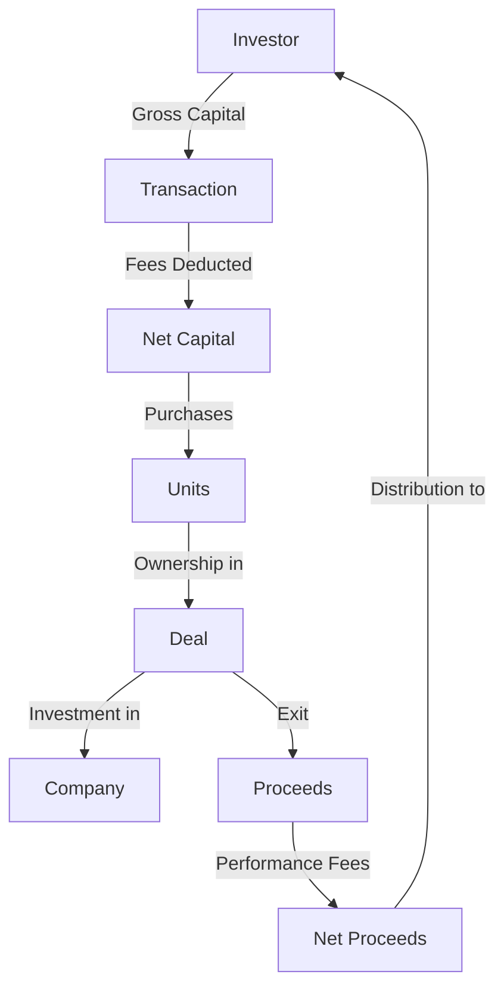

# EquiTie Business Glossary & Data Model Bible

## Executive Summary

This document serves as the single source of truth for EquiTie's data model, business terminology, and calculation logic. It consolidates the investment platform's core concepts, fee structures, and entity relationships to ensure consistent implementation across all systems.

## Core Business Model

### EquiTie Platform Overview

EquiTie operates as an alternative investment platform that structures deals between:
1. **Investors** - Individuals or entities providing capital
2. **Portfolio Companies** - Target companies receiving investment
3. **Partners** - Co-investment entities sharing deals
4. **EquiTie** - Platform operator earning various fees

### Investment Flow



## Entity Definitions

### 1. INVESTORS
**Purpose**: Master record of all individuals and entities participating in investments

**Key Concepts**:
- **Investor Types**: INDIVIDUAL (natural persons) vs COMPANY (legal entities)
- **KYC Compliance**: Identity verification required before transactions
- **Nominee Structure**: Investors can act on behalf of sub-nominees
- **Accreditation**: Track qualification for different investment types

**Critical Business Rules**:
- KYC must be `verified` status before processing any transaction
- Nominee relationships must maintain clear beneficial ownership chain
- Decision independence flag determines signing authority

### 2. DEALS
**Purpose**: Investment opportunities structured by EquiTie

**Deal Lifecycle**:
```
DRAFT → RAISING → ACTIVE → EXITED/CANCELLED
         ↓
    (accepting investments)
```

**Deal Types** (Business Models):
- **Primary**: Direct investment into companies
- **Secondary**: Purchase of existing shares from other investors
- **Advisory**: EquiTie earns advisory shares, minimal investor fees
- **Partnership**: Co-investment with partner entities, split fee structure
- **SPV**: Special Purpose Vehicle for pooled investments
- **Facilitated Direct/Indirect**: EquiTie facilitates but doesn't hold

### 3. COMPANIES
**Purpose**: Legal entities in the ecosystem

**Company Roles**:
- **Portfolio Company**: Target investment (linked via `underlying_company_id`)
- **Holding Entity**: SPV or legal structure holding the investment
- **Partner Company**: Co-investor or deal partner

**Key Insight**: A single company can play different roles across different deals

### 4. TRANSACTIONS
**Purpose**: Record of all capital movements and fee applications

**Transaction Types**:
- **Primary**: Initial investment into a deal
- **Secondary**: Transfer between investors
- **Advisory**: Fee-only transactions for advisory services
- **Subnominee**: Nominee structure transactions

**Critical Formula**:
```
Gross Capital → Apply Fees → Net Capital → Purchase Units
Units = Net Capital ÷ Initial Unit Price
```

## Fee Structure Bible

### Fee Categories & Timing

#### 1. Structuring Fee (One-time, Upfront)
- **When**: At investment
- **Base**: Gross Capital or Net Capital (deal-specific)
- **Who Charges**: EquiTie and/or Partner
- **Formula**: `structuring_fee = gross_capital × structuring_fee_rate × (1 - discount_rate)`

#### 2. Premium Fee (One-time, Upfront)
- **When**: At investment (success-based pricing)
- **Base**: Valuation differential
- **Formula**: 
  - Method 1: `(pre_money_sell_price / investor_share_price) - 1`
  - Method 2: `exit_unit_price / initial_unit_price`
- **Purpose**: Captures value creation between rounds

#### 3. Management Fee (Recurring, Annual)
- **When**: Annually during hold period
- **Base**: Assets Under Management (AUM)
- **Who Charges**: EquiTie and/or Partner
- **Tiers**: Can have multiple tiers (fee_1, fee_2)
- **Formula**: `annual_fee = AUM × management_fee_rate × (1 - discount_rate)`

#### 4. Performance Fee / Carry (One-time, Exit)
- **When**: At exit, on gains only
- **Base**: Profit (Exit Value - Initial Investment)
- **Industry Standard**: 20% (2 and 20 model)
- **Formula**: `performance_fee = MAX(0, (exit_value - initial_investment) × performance_rate × (1 - discount))`

#### 5. Admin Fee (One-time or Recurring)
- **When**: At transaction or periodically
- **Type**: Usually flat fee, not percentage
- **Who Charges**: EquiTie and/or Partner

### Fee Hierarchy & Application Order

1. **Gross Capital** (Investor commits)
2. Apply **Structuring Fee** (if applicable)
3. Apply **Premium** (if applicable)
4. = **Net Capital** (available for investment)
5. Purchase **Units** at **Initial Unit Price**
6. Apply **Management Fees** (annually)
7. At exit: Apply **Performance Fee** on gains
8. = **Net Proceeds** to investor

### Discount Framework

All discounts are expressed as rates between 0 and 1:
- `0` = No discount (pay full fee)
- `0.1` = 10% discount (pay 90% of fee)
- `1` = 100% discount (fee waived)

**Application**: `effective_fee = base_fee × (1 - discount_rate)`

## Unit Economics

### Core Concepts

1. **Initial Unit Price**: Standardized entry price (typically 1000)
2. **Units**: Ownership representation in the deal
3. **Unit Calculation**: `Units = Net Capital ÷ Initial Unit Price`
4. **Current Unit Price**: Mark-to-market valuation
5. **Exit Unit Price**: Final price at liquidation

### Valuation Metrics

- **MOIC** (Multiple on Invested Capital): `Exit Value ÷ Initial Investment`
- **IRR** (Internal Rate of Return): Annualized return considering time
- **Gross Multiple**: Before fees
- **Net Multiple**: After all fees

## Critical Business Rules

### Deal-Level Rules

1. **Deal Status Transitions**:
   - Can only accept investments when status = `RAISING`
   - Fees lock when status changes to `ACTIVE`
   - No modifications after status = `EXITED`

2. **Partnership Deals**:
   - Must have `partner_company_id`
   - Partner fee splits must sum to ≤ 100%
   - Both EquiTie and Partner fees tracked separately

3. **Advisory Deals**:
   - `advisory_shares_earned` > 0
   - Investor fees may be reduced or zero
   - EquiTie earns through advisory shares, not fees

### Transaction-Level Rules

1. **Validation**:
   - Transaction date ≥ Deal date
   - Investor KYC status = `verified`
   - Gross Capital > 0
   - Units > 0

2. **Fee Locking**:
   - Once `fee_calc_is_locked = TRUE`, no fee modifications
   - Lock timestamp recorded in `fee_calc_locked_at`
   - Prevents retroactive fee changes

3. **Nominee Structure**:
   - If `nominee = TRUE`, must have `subnominee_investor_id`
   - Subnominee must be valid investor
   - Maintains beneficial ownership trail

### Exit Rules

1. **Exit Validation**:
   - `deal_exited = TRUE` requires `exit_date`
   - `exit_date` ≥ `deal_date`
   - All units must be accounted for

2. **Distribution Waterfall**:
   1. Return of capital
   2. Preferred return (if applicable)
   3. Performance fee/carry
   4. Remaining to investors

## Data Quality Requirements

### Mandatory Fields by Entity

**Deals (at creation)**:
- deal_name
- deal_type
- deal_date
- initial_unit_price
- deal_currency

**Transactions (at creation)**:
- deal_id
- investor_id
- transaction_date
- gross_capital
- transaction_type

**Investors (before first transaction)**:
- full_name OR (first_name + last_name)
- primary_email
- investor_type
- kyc_status = 'verified'

### Calculated vs Input Fields

**Input Fields** (manually entered):
- All fee percentages
- Gross capital amounts
- Valuations
- Exchange rates

**Calculated Fields** (system-generated):
- Net capital (from gross - fees)
- Units (from net capital ÷ price)
- Fee amounts (from percentages)
- Current values (from units × current price)
- Performance metrics (IRR, MOIC)

## Foreign Exchange Handling

### Multi-Currency Support
- **Deal Currency**: Primary currency for the deal
- **Investor Currency**: Investor's preferred currency
- **Reporting Currency**: USD for consolidated reporting

### FX Application Points
1. **At Investment**: Convert to deal currency
2. **For Reporting**: Convert to USD using date-specific rates
3. **At Exit**: Convert proceeds to investor currency

### Rate Storage
- Historical rates stored with date stamps
- Source tracking for audit
- Applied rate locked at transaction

## Compliance & Audit

### KYC/AML Requirements
1. **Identity Verification**: Government ID + proof of address
2. **Source of Wealth**: Documentation required
3. **Accreditation**: Qualification for investment types
4. **Periodic Review**: KYC expires, requires renewal

### Audit Trail
- All monetary calculations logged
- Fee calculation snapshots stored
- User actions tracked with timestamps
- Change history maintained

### Document Requirements
**Deal Level**:
- Operating Agreement / LLC Agreement
- Side Letters (special terms)
- Term Sheets

**Transaction Level**:
- Subscription Agreement
- Closing Documents
- Wire Confirmations

**Investor Level**:
- KYC Documents
- Accreditation Certificates
- Tax Forms

## System Integration Points

### Required Integrations
1. **Banking**: Wire transfer confirmations
2. **KYC Provider**: Identity verification
3. **Document Management**: Legal document storage
4. **Accounting**: Financial reporting
5. **Tax Reporting**: K-1 generation

### API Contract
- All monetary values in smallest unit (cents)
- Dates in ISO 8601 format
- Percentages as decimals (0.02 = 2%)
- UUIDs for external references

## Glossary of Terms

| Term | Definition | Context |
|------|------------|---------|
| AUM | Assets Under Management | Basis for management fee |
| Carry | Carried Interest / Performance Fee | Share of profits |
| GP | General Partner | Fund manager (EquiTie) |
| LP | Limited Partner | Investor |
| NAV | Net Asset Value | Current value of holdings |
| SPV | Special Purpose Vehicle | Legal structure for investment |
| Waterfall | Distribution hierarchy | Order of payment priorities |
| Hurdle Rate | Minimum return before carry | Performance threshold |
| Clawback | Return of excess carry | GP gives back overpayment |
| Side Letter | Special terms agreement | Investor-specific modifications |

## Version Control

| Version | Date | Changes | Author |
|---------|------|---------|--------|
| 1.0 | 2024-11-26 | Initial comprehensive glossary | System |
| 1.1 | TBD | Add new fee types | TBD |

## Appendices

### A. Standard Fee Rates
- Management Fee: 2% annually
- Performance Fee: 20% of gains
- Structuring Fee: 2.5-10% upfront
- Admin Fee: $350-450 flat

### B. Calculation Examples
[Detailed examples with actual numbers for each fee type]

### C. Edge Cases
1. Negative returns: Performance fee = 0
2. Partial exits: Pro-rata calculations
3. Currency fluctuations: Locked at transaction
4. Fee waivers: Discount = 1.0

### D. Migration from Legacy
- Map dot-notation tables to clean tables
- Preserve historical fee calculations
- Maintain audit trail through migration