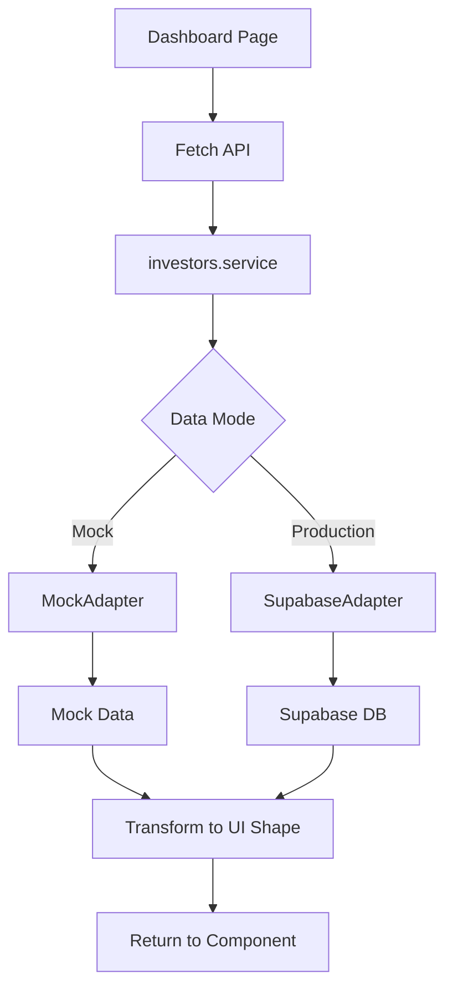

# 15.1.1 Investor Portal Dashboard

## Feature Code
`15.1.1` - Investor App > Investor Portal > Dashboard

## Overview
The investor portal dashboard provides a comprehensive view of an investor's portfolio, performance metrics, and recent activity. It serves as the primary landing page for investors accessing the platform.

## Scope
- Portfolio value summary with key metrics
- Performance indicators (IRR, MOIC, DPI, TVPI)
- Recent activity feed
- Quick action links to other portal sections
- Responsive design for mobile and desktop

## Entry Points

### UI Pages
- **Main Dashboard**: `/app/investor-portal/dashboard/page.tsx`
- **Layout**: `/app/investor-portal/layout.tsx`

### Components
- **PortfolioCard**: `/app/investor-portal/dashboard/components/PortfolioCard.tsx`
- **PerformanceChart**: `/app/investor-portal/dashboard/components/PerformanceChart.tsx`
- **RecentActivity**: `/app/investor-portal/dashboard/components/RecentActivity.tsx`
- **QuickActions**: `/app/investor-portal/dashboard/components/QuickActions.tsx`

### API Routes
- **Dashboard Data**: `/app/api/investors/[id]/dashboard/route.ts`
- **Portfolio Data**: `/app/api/investors/[id]/portfolio/route.ts`
- **Transactions**: `/app/api/investors/[id]/transactions/route.ts`

### Services
- **InvestorsService**: `/lib/services/investors.service.ts`
  - `getDashboardData(investorId)`
  - `getPortfolioData(investorId)`
  - `getTransactions(investorId)`
  - `getCommitments(investorId)`

## Data Flow



## API Contract

### GET /api/investors/[id]/dashboard

**Response Shape**:
```typescript
{
  portfolio: {
    totalValue: number;
    totalCommitted: number;
    totalDistributed: number;
    unrealizedGain: number;
  };
  performance: {
    irr: number;
    moic: number;
    dpi: number;
    tvpi: number;
  };
  recentActivity: Array<{
    id: string;
    type: string;
    description: string;
    amount?: number;
    date: string;
  }>;
  activeDeals: number;
}
```

## Database Tables

### Primary Tables
- `investors.investor` - Investor profiles
- `investor_analytics` - Pre-calculated metrics
- `portfolio_analytics` - Platform-wide analytics
- `transactions.transaction.primary` - Transaction history
- `deals.deal` - Active deals

### Analytics Views
- `analytics.v_investor_dashboard` - Dashboard summary data
- `analytics.v_portfolio_performance` - Performance metrics
- `analytics.v_recent_activity` - Activity feed

## Configuration

### Environment Variables
```env
# Data Source
NEXT_PUBLIC_USE_MOCK_DATA=false  # Use mock data
NEXT_PUBLIC_ENABLE_SUPABASE=true # Enable Supabase

# Supabase
NEXT_PUBLIC_SUPABASE_URL=https://ikezqzljrupkzmyytgok.supabase.co
NEXT_PUBLIC_SUPABASE_ANON_KEY=your-key
```

### Mock Data
Located in `/lib/mock-data/`:
- `investors.ts` - Sample investor profiles
- `performance.ts` - Mock performance metrics
- `transactions.ts` - Sample transactions

## Testing

### E2E Tests
```bash
npx playwright test investor-portal.spec.ts
```

### Test Coverage
- Dashboard loads with correct data
- Portfolio metrics display accurately
- Performance indicators calculate correctly
- Recent activity shows latest transactions
- Quick actions navigate properly
- Responsive layout works on mobile

## UI/UX Guidelines

### Design Principles
1. **Information Hierarchy**: Most important metrics at top
2. **Progressive Disclosure**: Summary first, details on demand
3. **Responsiveness**: Mobile-first design
4. **Accessibility**: WCAG 2.1 AA compliance
5. **Performance**: <500ms initial load

### Brand Tokens
```typescript
import { BRAND_CONFIG } from '@/BRANDING/brand.config';

// Use brand colors
const primaryColor = BRAND_CONFIG.colors.primary.hero;
const cardStyle = COMPONENT_STYLES.card.gradient;
```

### Component Styling
- Cards use glass morphism effect
- Gradient borders for emphasis
- Consistent spacing using brand tokens
- Dark theme optimized

## Common Tasks

### Adding a New Metric
1. Update service method in `investors.service.ts`
2. Add to API response shape
3. Update dashboard component
4. Add test coverage

### Customizing for an Investor
1. Check investor type in service
2. Apply conditional logic
3. Return customized data

### Performance Optimization
1. Use service layer caching
2. Implement pagination for activity
3. Lazy load chart components
4. Use React.memo for static sections

## Implementation Status

### ✅ Completed
- Dashboard page component
- API endpoint with shape mapping
- Service layer integration
- Mock/Supabase switching
- Portfolio metrics display
- Performance indicators
- Recent activity feed
- Responsive layout

### 🚧 In Progress
- Chart visualizations
- Real-time updates
- Export functionality

### 📋 Planned
- Customizable widgets
- Saved views
- Advanced filtering
- Comparison tools

## Related Features
- **15.1.2** - Portfolio Details
- **15.1.3** - Transaction History
- **15.1.4** - Documents
- **15.1.5** - Profile Management

## Support Documents
- [API Documentation](./docs/API.md)
- [UI Components](./docs/UI.md)
- [Testing Guide](./docs/TESTS.md)
- [Database Schema](./docs/DB.md)

## Owners
- Feature Lead: Investor Experience Team
- Technical Lead: Platform Team
- Design Lead: UX Team