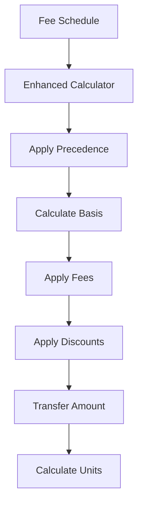

# 7 - ARCHON Fee Engine

## Feature Code
`7` - Fees Domain (ARCHON Fee Calculation Engine)

## Overview
The ARCHON Fee Engine is a deterministic, precedence-based fee calculation system that handles complex investment fee structures with support for multiple fee components, discounts, and partner transfers.

## Core Principles

### 1. Precedence Algorithm
Fees are applied in strict precedence order:
- PREMIUM always has precedence = 1
- Other fees follow sequential precedence
- Lower precedence numbers are applied first

### 2. Basis Types
- **GROSS**: Based on gross capital amount
- **NET**: Based on remaining after previous fees
- **NET_AFTER_PREMIUM**: Net amount after premium fee only

### 3. Discount Handling
- Discounts stored as NEGATIVE amounts in database
- Applied as reductions to base fees
- Can be percentage or fixed amounts

### 4. Partner Fees
- Prefixed with `PARTNER_` 
- Excluded from investor analytics
- Examples: PARTNER_CARRY, PARTNER_PROMOTE

## Architecture



## Implementation

### Core Services
- **Enhanced Calculator**: `/lib/services/fee-engine/enhanced-calculator.ts`
- **Enhanced Service**: `/lib/services/fee-engine/enhanced-service.ts`
- **Fee Service Wrapper**: `/lib/services/fees.service.ts`

### Database Schema

```sql
-- Fee Schedule (configuration)
fees.fee_schedule (
  schedule_id SERIAL PRIMARY KEY,
  deal_id INTEGER,
  component TEXT,
  rate DECIMAL(10,4),
  is_percent BOOLEAN,
  basis TEXT,
  precedence INTEGER,
  effective_at TIMESTAMP
)

-- Fee Application (actual fees)
fees.fee_application (
  id SERIAL PRIMARY KEY,
  transaction_id INTEGER,
  deal_id INTEGER,
  component TEXT,
  amount DECIMAL(15,2),  -- Negative for discounts
  percent DECIMAL(10,4),
  applied BOOLEAN,
  notes TEXT
)
```

## Calculation Formula

```typescript
function calculateFees(schedule: FeeSchedule[], gross: number) {
  let net = gross;
  let premium = 0;
  
  // Sort by precedence
  schedule.sort((a, b) => a.precedence - b.precedence);
  
  for (const fee of schedule) {
    const basis = fee.basis === 'GROSS' ? gross :
                  fee.basis === 'NET' ? net :
                  net - premium;
    
    const amount = fee.is_percent ? 
      basis * fee.rate / 100 : fee.rate;
    
    if (fee.component === 'PREMIUM') {
      premium = amount;
    }
    
    net -= amount;
  }
  
  return { gross, net, premium, transfer: net };
}
```

## Admin Interfaces

Multiple interfaces for different workflows:

1. **Fee Profiles** (`/admin/fees/profiles`) - Configuration management
2. **Import V2** (`/admin/fees/import-v2`) - Enhanced CSV import
3. **Smart Import** (`/admin/fees/smart-import`) - AI-powered mapping
4. **ARCHON Calculator** (`/admin/equitie-fee-engine`) - Interactive testing
5. **Deal Equations** (`/admin/deal-equations`) - Custom formulas
6. **Fee Hub** (`/admin/fees`) - Central dashboard

See [ADMIN_TOOLS.md](./docs/ADMIN_TOOLS.md) for detailed documentation.

## API Endpoints

### Preview Fees
```typescript
POST /api/admin/fees/validate
{
  dealId: 1,
  grossCapital: 1000000,
  unitPrice: 1000,
  discounts: [
    { component: 'STRUCTURING_DISCOUNT', percent: 50 }
  ]
}
```

### Apply Fees
```typescript
POST /api/admin/fees/apply
{
  transactionId: 123,
  calculation: { /* from preview */ }
}
```

### Import CSV
```typescript
POST /api/admin/fees/import
Content-Type: multipart/form-data
file: fees.csv
```

## Testing

### Unit Tests
```bash
npm run test:fees
```

Test files:
- `enhanced-calculator.test.ts` - Core calculation logic
- `fee-calculator.test.ts` - Legacy calculator
- `deal-equation.test.ts` - Custom equations

### E2E Tests
```bash
npx playwright test fee-engine.spec.ts
npx playwright test fee-management.spec.ts
```

## Common Use Cases

### Setting Up a New Deal
1. Create fee profile in `/admin/fees/profiles`
2. Configure fee components with precedence
3. Test calculations in ARCHON calculator
4. Import investor data
5. Apply fees to transactions

### Importing Historical Fees
1. Prepare CSV with required columns
2. Use Smart Import for automatic mapping
3. Review and adjust mappings
4. Preview calculations
5. Apply to database

### Custom Fee Structures
1. Use Deal Equations for complex formulas
2. Define variables and calculations
3. Test with sample data
4. Apply to specific deals

## Validation Rules

### Invariants
1. PREMIUM must have precedence = 1
2. Precedence values must be unique per deal
3. Amounts rounded to 2 decimal places
4. Units are integers (floor division)
5. Discounts must be negative amounts

### Business Rules
1. Total fees cannot exceed gross capital
2. Transfer amount must be positive
3. Partner fees excluded from investor views
4. Audit trail required for all applications

## Error Handling

Common errors and solutions:

### Precedence Conflicts
- **Error**: Multiple fees with same precedence
- **Solution**: Ensure unique precedence values

### Basis Mismatches
- **Error**: Invalid basis type
- **Solution**: Use GROSS, NET, or NET_AFTER_PREMIUM

### Rounding Issues
- **Error**: Precision loss in calculations
- **Solution**: Round at final step only

## Performance Considerations

### Caching
- Fee schedules cached for 60 seconds
- Calculation results cached per transaction
- Cache invalidated on schedule changes

### Batch Processing
- Import processes up to 1000 rows at once
- Calculations parallelized where possible
- Database operations use transactions

## Migration from Legacy

### Differences from Old System
1. Precedence-based vs sequential
2. Explicit basis types
3. Negative discount amounts
4. Partner fee exclusion

### Migration Steps
1. Export legacy fee data
2. Map to new schema format
3. Import via Smart Import
4. Validate calculations
5. Run parallel for verification

## Support Documents

- [Detailed Context](../../../ARCHON_FEE_ENGINE_CONTEXT.md)
- [Admin Tools Guide](./docs/ADMIN_TOOLS.md)
- [API Documentation](./docs/API.md)
- [Database Schema](./docs/DB.md)
- [Testing Guide](./docs/TESTS.md)

## Roadmap

### Current
- Multiple import interfaces
- Precedence-based calculation
- Discount handling
- Partner fee exclusion

### Planned
- Real-time fee updates
- Multi-currency support
- Advanced reporting
- API rate limiting
- Webhook notifications

## Owners
- Technical Lead: Platform Team
- Product Owner: Finance Team
- QA Lead: Testing Team