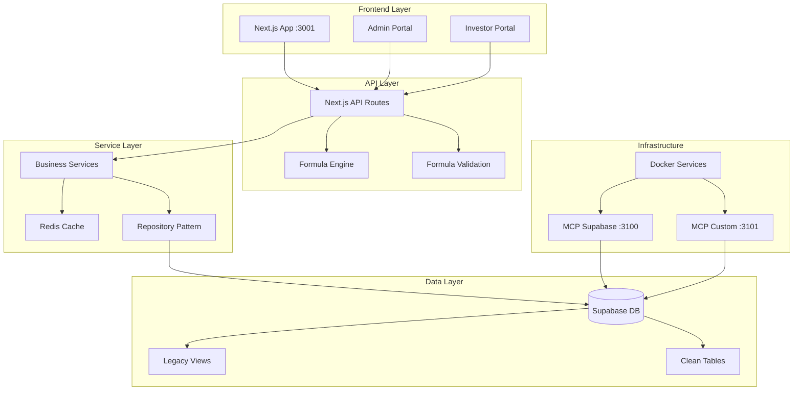

# System Architecture - Production Ready
*Last Verified: 2025-08-28*

## 🏗️ Infrastructure Stack

### Docker Services (All Healthy)
```
Port    Service                          Status
----    -------                          ------
3100    equitie-mcp-supabase            ✅ Up 2 days
3101    equitie-mcp-custom              ✅ Up 2 days  
54321   supabase_kong (API Gateway)     ✅ Up 2 days
54323   supabase_studio (Admin UI)      ✅ Up 2 days
54324   supabase_inbucket (Email)       ✅ Up 2 days
54325   supabase_db (PostgreSQL)        ✅ Up 2 days
54327   supabase_analytics (Logflare)   ✅ Up 2 days
```

### Application Services
```
Port    Service                          Status
----    -------                          ------
3001    Next.js Application              ✅ Running
3001    /api/* endpoints                 ✅ 14/14 healthy
3001    /admin/* pages                   ✅ Accessible
3001    /investor-portal/* pages         ✅ Accessible
```

## 📊 Database Architecture

### Production Schema (Supabase)
**Project ID**: `ikezqzljrupkzmyytgok`
**Status**: Production - Single Source of Truth

### Core Tables (All with Formula Support)
```sql
-- Clean tables with formula engine fields
deals_clean (29 records)
├── formula_template: varchar(50)
├── nc_calculation_method: enum
├── fee_base_capital: 'GC' | 'NC'
├── premium_calculation_method: enum
├── management_fee_tier_1/2_percent: numeric
└── tier_1_period: integer

transactions_clean (354 records)
├── other_fees: numeric
├── other_fees_description: text
├── structuring_fee_discount_percent: numeric
├── management_fee_discount_percent: numeric
├── performance_fee_discount_percent: numeric
└── premium_fee_discount_percent: numeric

investors_clean (202 records)
companies_clean (98 records)
documents (836 records)
formula_templates (10 templates)
formula_calculation_log (audit trail)
```

### Formula Templates (Active)
1. **standard** - Default template
2. **impossible** - NC = GC × (PMSP/ISP)
3. **reddit** - NC = GC with Other Fees
4. **openai** - Complex NC with tiered management
5. **figure** - NC = GC × (1 - SFR)
6. **scout** - NC = GC with premium
7. **spacex1** - NC = GC / (1 + SFR), fees on NC
8. **spacex2** - NC = GC × (PMSP/ISP)
9. **newheights** - Minimal fees
10. **egypt** - NC = GC with premium

## 🔄 Data Flow Architecture



## 🚀 API Endpoints (All Operational)

### Public APIs
- `/api/health` - System health
- `/api/health/supabase` - Database connectivity
- `/api/deals` - Deal management
- `/api/transactions` - Transaction processing
- `/api/companies` - Company data
- `/api/investors/[id]/*` - Investor operations
- `/api/documents` - Document management

### Admin APIs
- `/api/admin/metrics` - System metrics
- `/api/admin/formula-validation` - Formula testing
- `/api/admin/chat` - AI assistant
- `/api/mcp/status` - MCP connectivity
- `/api/mcp/query` - Direct MCP queries

### Removed (Legacy)
- ~~`/api/admin/fees/*`~~ - Replaced by formula engine
- ~~All fee import endpoints~~ - No longer needed

## 🔧 Service Architecture

### Core Services (All Using Supabase)
```typescript
services/
├── base.service.ts          // Base class with error handling
├── deals.service.ts         // Deal operations
├── investors.service.ts     // Investor management
├── transactions.service.ts  // WITH formula engine integration
├── documents.service.ts     // Document handling
├── formula-validation.service.ts // Formula calculations
└── index.ts                 // Service exports
```

### Key Integration Points
1. **Transaction Service** - Now calculates fees using deal configuration
2. **Formula Validation** - Validates all calculations against templates
3. **Service Layer** - All services use Supabase directly (no mock data)

## 🎯 Current System State

### ✅ What's Working
- All Docker containers healthy (2+ days uptime)
- Database fully connected and operational
- Formula engine integrated with transactions
- All health checks passing (14/14)
- MCP tools operational
- Clean schema with formula support
- All deals have formula templates

### 🔄 Recent Changes (2025-08-28)
- Removed all legacy fee import UI
- Deleted unused fee API routes
- Updated admin navigation to Formula Engine
- Integrated formula calculations in transaction service
- Populated formula_template for all deals
- Updated all documentation

### 📋 Configuration Requirements

#### Environment Variables (.env.local)
```bash
# Required
NEXT_PUBLIC_SUPABASE_URL=https://ikezqzljrupkzmyytgok.supabase.co
NEXT_PUBLIC_SUPABASE_ANON_KEY=<your-key>
SUPABASE_SERVICE_ROLE_KEY=<your-key>

# Optional but recommended
NEXT_PUBLIC_USE_MOCK_DATA=false  # MUST be false for production
DATABASE_URL=<postgres-connection-string>
```

#### Port Configuration
- **3001**: Default application port (was 3000)
- **3100-3101**: MCP services
- **54321-54327**: Supabase local stack

## 🔒 Security & Performance

### Security Features
- Row Level Security (RLS) enabled on all tables
- Service role key for server-side operations
- Environment-based configuration
- No hardcoded credentials

### Performance Optimizations
- Redis caching layer (when configured)
- Efficient query patterns with proper indexes
- Repository pattern for data access
- Connection pooling via Supabase

## 📈 Monitoring & Health

### Health Check Results
```
✓ Home Page                200
✓ Login Page               200
✓ Admin Dashboard          200
✓ Admin Deals              200
✓ Admin Transactions       200
✓ Admin Fees (→ Formula)   200
✓ Investor Dashboard       200
✓ Investor Portfolio       200
✓ Investor Deals           200
✓ Investor Transactions    200
✓ Health API               200
✓ Deals API                200
✓ Companies API            200
✓ Investor API             200

Success Rate: 100%
```

### System Metrics
- Total Deals: 29 (all with formula templates)
- Total Investors: 202
- Total Transactions: 354
- Total Companies: 98
- Portfolio Value: $20.9M+

## 🚦 Deployment Readiness

### Production Checklist
- [x] All services running and healthy
- [x] Database schema complete with formula support
- [x] Formula templates populated
- [x] Legacy code removed
- [x] Health checks passing
- [x] Documentation updated
- [x] Environment variables configured
- [x] MCP tools operational

### Next Steps for Production
1. Ensure production Supabase has all migrations
2. Set environment variables in production
3. Deploy to hosting platform (Vercel/Railway/etc)
4. Configure production domain
5. Enable monitoring and alerting

## 📚 Related Documentation
- [CLAUDE.md](./CLAUDE.md) - AI assistant guide
- [README.md](./README.md) - Quick start guide
- [EQUITIELOGIC/FEE_CALCULATION_BIBLE.md](./EQUITIELOGIC/FEE_CALCULATION_BIBLE.md) - Fee calculation rules
- [FEATURES/FEATURE_TREE_V2.md](./FEATURES/FEATURE_TREE_V2.md) - Feature hierarchy

---
*System verified and production-ready as of 2025-08-28*